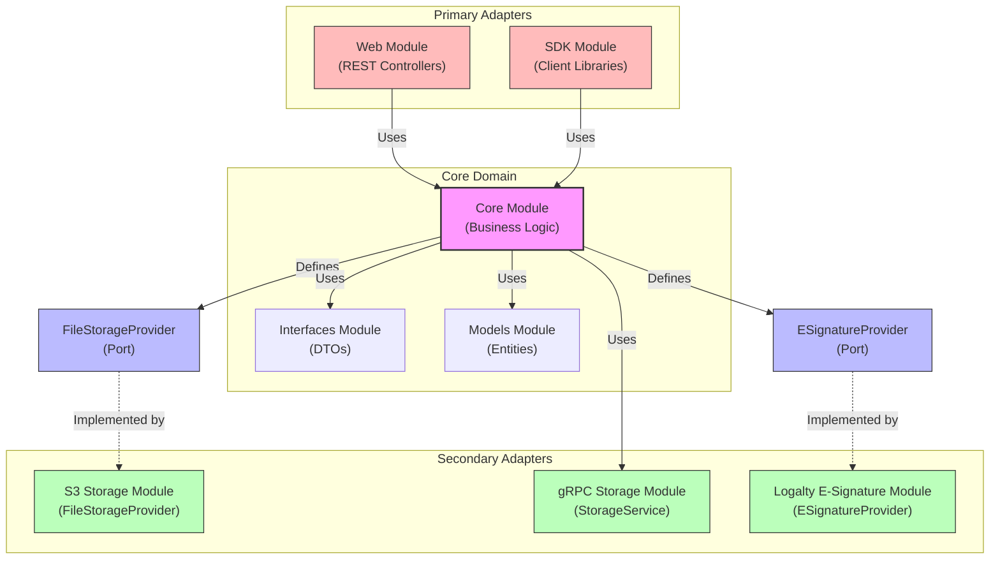
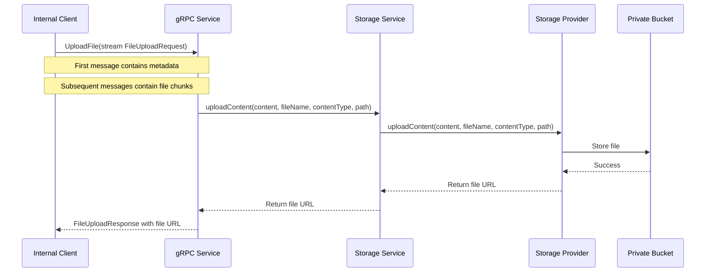
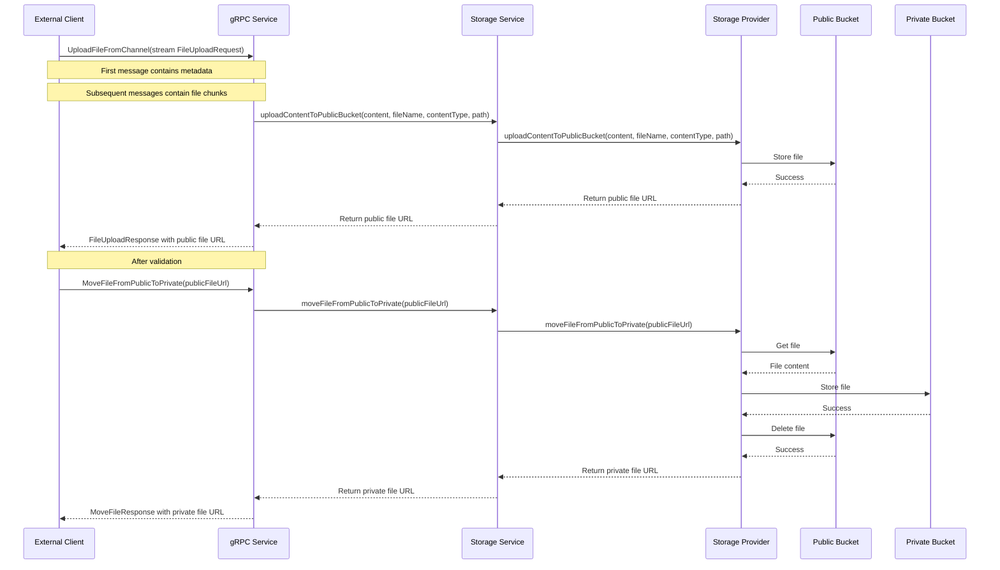
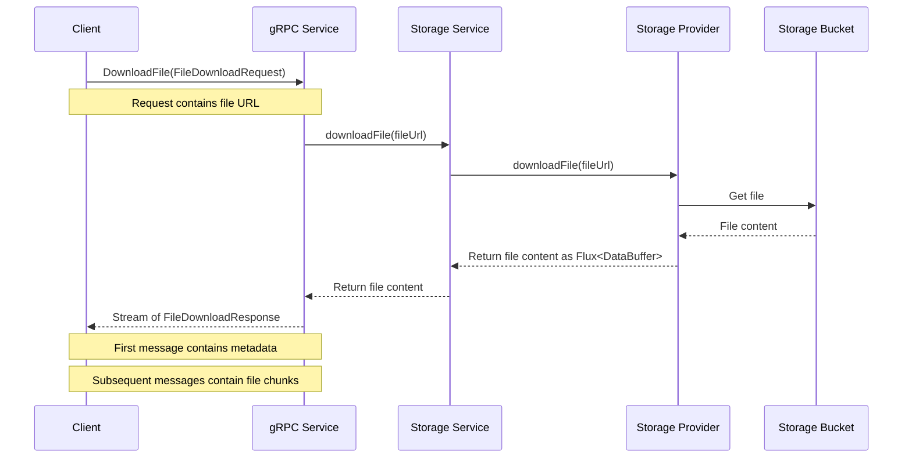
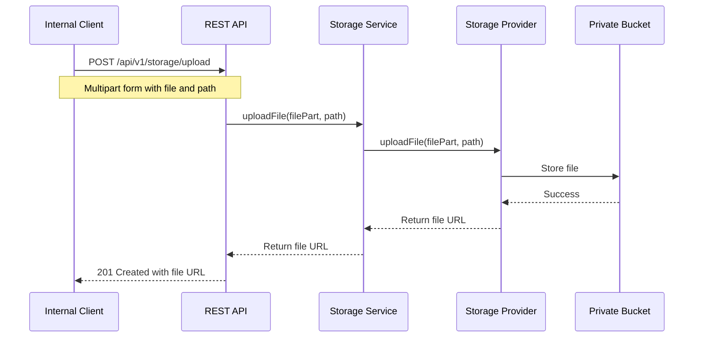
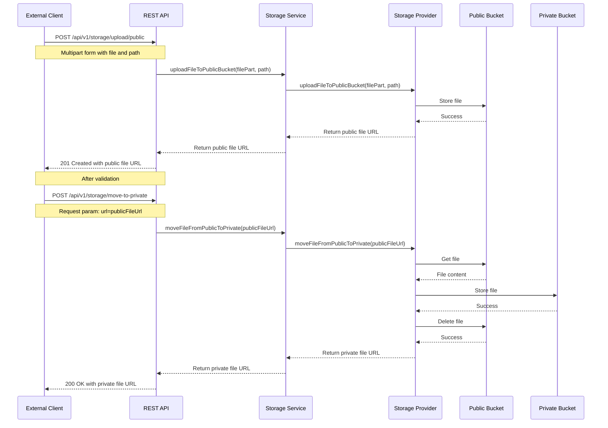
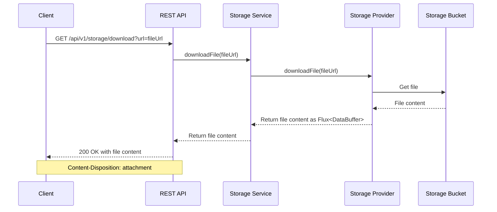

# Firefly Enterprise Content Management

A microservice for managing enterprise documents, including versioning, tagging, references, and digital signatures.

## Table of Contents

- [Overview](#overview)
- [Architecture](#architecture)
- [Entity Relationship Diagram](#entity-relationship-diagram)
- [API Quickstart](#api-quickstart)
  - [Document Management](#document-management)
  - [Document Versions](#document-versions)
  - [Document Tags](#document-tags)
  - [Document References](#document-references)
  - [Signature Requests](#signature-requests)
  - [Signature Proofs](#signature-proofs)
- [Getting Started](#getting-started)
  - [Prerequisites](#prerequisites)
  - [Installation](#installation)
  - [Configuration](#configuration)
- [Contributing](#contributing)
- [License](#license)

## Overview

Firefly Enterprise Content Management (ECM) is a comprehensive solution for managing documents and their lifecycle within an enterprise environment. The system provides capabilities for document storage, versioning, categorization, and digital signatures.

Key features include:
- Document management with versioning
- Document tagging and categorization
- Document references and relationships
- Digital signature workflows
- Notification system for document events

## Architecture

The application is built using a hexagonal architecture (also known as ports and adapters) with the following components:

- **common-platform-document-mgmt-core**: Core business logic, services, and provider interfaces (ports)
- **common-platform-document-mgmt-interfaces**: Interfaces and DTOs for external communication
- **common-platform-document-mgmt-models**: Entity models and repositories
- **common-platform-document-mgmt-sdk**: SDK components and API specifications
- **common-platform-document-mgmt-web**: Web controllers and application configuration
- **common-platform-document-mgmt-storage-s3**: Amazon S3 implementation of the storage provider interface
- **common-platform-document-mgmt-storage-grpc**: gRPC service implementation for storage operations
- **common-platform-document-mgmt-esignature-logalty**: Logalty implementation of the e-signature provider interface

The application is built with Spring Boot and uses reactive programming with Project Reactor for asynchronous, non-blocking operations.

### Hexagonal Architecture

The application follows the hexagonal architecture pattern, which separates the core business logic from external dependencies:

- **Core Domain**: Contains the business logic and defines interfaces (ports) for interacting with external systems
- **Ports**: Interfaces that define how the core domain interacts with the outside world
- **Adapters**: Implementations of the ports that connect the core domain to specific technologies or external systems

This architecture provides several benefits:
- **Modularity**: Each component has a clear responsibility and can be developed and tested independently
- **Flexibility**: Different implementations of the same port can be swapped without affecting the core business logic
- **Testability**: The core business logic can be tested without depending on external systems

#### Architecture Diagram



The diagram illustrates the hexagonal architecture of the document management system:

1. **Primary Adapters** (driving adapters) on the left side initiate interactions with the core domain:
   - Web Module: Exposes the core functionality as a REST API
   - SDK Module: Provides client libraries for external systems

2. **Core Domain** in the center contains the business logic and defines the ports:
   - Core Module: Contains the business logic and defines the provider interfaces (ports)
   - Interfaces Module: Contains DTOs for communication between layers
   - Models Module: Contains the domain entities and repositories

3. **Secondary Adapters** (driven adapters) on the right side implement the ports defined by the core domain:
   - S3 Storage Module: Implements the FileStorageProvider interface for Amazon S3
   - gRPC Storage Module: Exposes the storage functionality as a gRPC service
   - Logalty E-Signature Module: Implements the ESignatureProvider interface for Logalty

### Storage Providers

The application supports multiple storage providers through the `FileStorageProvider` interface:

```java
public interface FileStorageProvider {
    Mono<String> uploadFile(FilePart filePart, String path);
    Mono<String> uploadFileToPublicBucket(FilePart filePart, String path);
    Mono<String> uploadContent(Flux<DataBuffer> content, String fileName, String contentType, String path);
    Mono<String> uploadContentToPublicBucket(Flux<DataBuffer> content, String fileName, String contentType, String path);
    Mono<String> moveFileFromPublicToPrivate(String publicFileUrl);
    Flux<DataBuffer> downloadFile(String fileUrl);
    Mono<Void> deleteFile(String fileUrl);
    Mono<Boolean> fileExists(String fileUrl);
    Mono<String> generatePresignedUrl(String fileUrl, long expirationInSeconds);
    String getProviderName();
}
```

The `FileStorageProviderRegistry` manages the available storage providers and allows the application to select the appropriate provider at runtime.

Currently, the application includes the following storage provider implementations:
- **S3StorageProviderImpl**: Stores files in Amazon S3
- **GrpcStorageServiceImpl**: Exposes storage operations over gRPC for remote clients

#### Two-Bucket Storage System

The application implements a two-bucket storage system to optimize file uploads and improve security:

1. **Private Bucket**: The main storage bucket for all documents. This bucket is not directly accessible from outside the system.
2. **Public Bucket**: A temporary storage bucket for files uploaded from external channels. Files in this bucket are moved to the private bucket after validation.

This approach provides several benefits:
- **Reduced Network Traffic**: Files uploaded from external channels don't need to pass through multiple network layers.
- **Improved Security**: The private bucket is not directly accessible from outside the system.
- **Better User Experience**: Direct uploads to the public bucket are faster and more reliable.

The workflow for file uploads depends on the source:
- **Internal Uploads**: Files uploaded from internal systems go directly to the private bucket.
- **Channel Uploads**: Files uploaded from external channels go to the public bucket first, then are moved to the private bucket after validation.

### E-Signature Providers

The application supports multiple e-signature providers through the `ESignatureProvider` interface:

```java
public interface ESignatureProvider {
    Mono<SignatureRequestDTO> initiateSignatureRequest(SignatureRequestDTO signatureRequest);
    Mono<SignatureRequestDTO> getSignatureRequestStatus(Long signatureRequestId, String externalSignatureId);
    Mono<Void> cancelSignatureRequest(Long signatureRequestId, String externalSignatureId);
    Mono<SignatureProofDTO> getSignatureProof(Long signatureRequestId, String externalSignatureId);
    Mono<Boolean> validateSignatureProof(SignatureProofDTO signatureProof);
    String getProviderName();
}
```

The `ESignatureProviderRegistry` manages the available e-signature providers and allows the application to select the appropriate provider at runtime.

Currently, the application includes the following e-signature provider implementations:
- **LogaltyProviderImpl**: Integrates with the Logalty e-signature service

### gRPC Implementation

The application includes a gRPC service for storage operations, which allows remote clients to:
- Upload files (directly to private bucket for internal use)
- Upload files from channel (to public bucket)
- Move files from public to private bucket
- Download files
- Delete files
- Check if files exist
- Generate pre-signed URLs

The gRPC service is implemented in the `common-platform-document-mgmt-storage-grpc` module and uses the core `StorageService` to perform the actual storage operations. This allows the gRPC service to leverage the same storage provider infrastructure as the rest of the application.

#### File Upload and Download Flows (gRPC)

The gRPC service provides different flows for internal and external (channel) file operations:

##### Internal Upload Flow (gRPC)

For files uploaded from internal systems, the flow is:



##### External (Channel) Upload Flow (gRPC)

For files uploaded from external channels, the flow is:



##### File Download Flow (gRPC)

The download flow is the same for both internal and external clients:



This workflow reduces network traffic by avoiding the need to pass binary data through multiple network layers, resulting in better performance and user experience.

### REST API Implementation

The application also provides a REST API for storage operations through the `StorageController`. This controller exposes endpoints for:
- Uploading files to the private bucket
- Uploading files to the public bucket
- Moving files from public to private bucket
- Downloading files
- Deleting files
- Checking if files exist
- Generating pre-signed URLs

#### File Upload and Download Flows (REST)

The REST API provides different flows for internal and external (channel) file operations:

##### Internal Upload Flow (REST)

For files uploaded from internal systems, the flow is:



##### External (Channel) Upload Flow (REST)

For files uploaded from external channels, the flow is:



##### File Download Flow (REST)

The download flow is the same for both internal and external clients:



This REST API provides a standard HTTP interface for file operations, making it easy to integrate with web applications and other systems that prefer REST over gRPC.

## Entity Relationship Diagram


## API Quickstart

The Firefly ECM provides a RESTful API for managing documents and related entities. All endpoints return reactive Mono or Flux responses.

### Document Management

#### Get Document by ID
```
GET /api/v1/documents/{id}
```

#### Filter Documents
```
POST /api/v1/documents/filter
Content-Type: application/json

{
  "filters": [...],
  "page": 0,
  "size": 10,
  "sort": [...]
}
```

#### Create Document
```
POST /api/v1/documents
Content-Type: application/json

{
  "title": "Document Title",
  "description": "Document Description",
  "ownerDepartment": "Department Name",
  "documentTypeId": 1
}
```

#### Update Document
```
PUT /api/v1/documents/{id}
Content-Type: application/json

{
  "title": "Updated Title",
  "description": "Updated Description",
  "ownerDepartment": "Department Name",
  "documentTypeId": 1,
  "statusId": 2
}
```

#### Delete Document
```
DELETE /api/v1/documents/{id}
```

### Document Versions

#### Get Document Version
```
GET /api/v1/documents/{documentId}/versions/{versionId}
```

#### Get All Versions of a Document
```
GET /api/v1/documents/{documentId}/versions
```

#### Create Document Version
```
POST /api/v1/documents/{documentId}/versions
Content-Type: application/json

{
  "versionNumber": 1,
  "changeSummary": "Initial version",
  "fileName": "document.pdf",
  "blobStorageUrl": "https://storage.example.com/document.pdf",
  "effectiveDate": "2025-07-29T16:41:00Z"
}
```

### Document Tags

#### Add Tag to Document
```
POST /api/v1/documents/{documentId}/tags
Content-Type: application/json

{
  "tagId": 1
}
```

#### Remove Tag from Document
```
DELETE /api/v1/documents/{documentId}/tags/{tagId}
```

### Document References

#### Create Document Reference
```
POST /api/v1/documents/{documentId}/references
Content-Type: application/json

{
  "relatedDocumentId": 2,
  "referenceTypeId": 1,
  "note": "Related document"
}
```

### Signature Requests

#### Create Signature Request
```
POST /api/v1/signature-requests
Content-Type: application/json

{
  "documentId": 1,
  "requestDate": "2025-07-29T16:41:00Z",
  "signatoryOrder": 1,
  "interveningParties": "Party A, Party B"
}
```

#### Get Signature Request by ID
```
GET /api/v1/signature-requests/{id}
```

#### Update Signature Request
```
PUT /api/v1/signature-requests/{id}
Content-Type: application/json

{
  "documentId": 1,
  "statusId": 2,
  "signatoryOrder": 1,
  "interveningParties": "Party A, Party B, Party C"
}
```

### Signature Proofs

#### Create Signature Proof
```
POST /api/v1/signature-proofs
Content-Type: application/json

{
  "signatureRequestId": 1,
  "proofTypeId": 1,
  "statusId": 1,
  "proofData": "Base64 encoded proof data",
  "proofDate": "2025-07-29T16:41:00Z"
}
```

#### Get Signature Proof by ID
```
GET /api/v1/signature-proofs/{id}
```

## Getting Started

### Prerequisites

- Java 17 or higher
- Maven 3.8 or higher
- PostgreSQL database

### Installation

1. Clone the repository
```bash
git clone https://github.com/your-organization/common-platform-document-mgmt.git
cd common-platform-document-mgmt
```

2. Build the project
```bash
mvn clean install
```

3. Run the application
```bash
java -jar common-platform-document-mgmt-web/target/common-platform-document-mgmt-web.jar
```

### Configuration

The application can be configured through the `application.yaml` file in the `common-platform-document-mgmt-web/src/main/resources` directory.

Key configuration properties:
- Database connection
- Storage configuration
- Security settings
- Logging configuration

## Contributing

Please read the CONTRIBUTING.md file for details on our code of conduct and the process for submitting pull requests.

## License

This project is licensed under the terms specified in the LICENSE file.