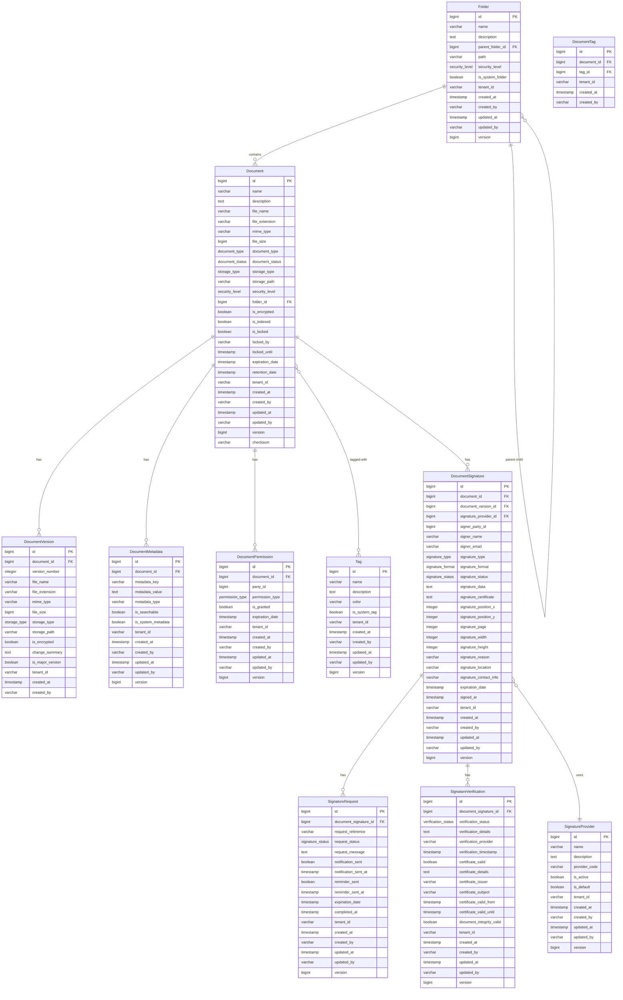

# Enterprise Content Management Microservice

## Table of Contents
- [Overview](#overview)
- [Architecture](#architecture)
- [Data Model](#data-model)
- [Features](#features)
- [Plugin System](#plugin-system)
  - [Storage Providers](#storage-providers)
  - [Signature Providers (QTSP)](#signature-providers-qtsp)
- [API Reference](#api-reference)
- [Installation and Configuration](#installation-and-configuration)
- [Development Guidelines](#development-guidelines)

## Overview

The Enterprise Content Management (ECM) Microservice is a comprehensive solution for managing documents, signatures, and related content in enterprise applications. It provides a robust set of features for document storage, versioning, metadata management, tagging, permissions, and digital signatures through Qualified Trust Service Providers (QTSP).

Built on a modern reactive stack with Spring WebFlux and R2DBC, this microservice offers high performance and scalability while maintaining a clean, modular architecture. The plugin system allows for easy integration with various storage backends and signature providers.

## Architecture

The ECM Microservice follows a modular, layered architecture:

1. **Web Layer**: REST controllers that expose the API endpoints
2. **Service Layer**: Business logic implementation
3. **Repository Layer**: Data access using reactive repositories
4. **Plugin Layer**: Extensible system for storage and signature providers

Key technologies:
- **Spring Boot**: Application framework
- **Spring WebFlux**: Reactive web framework
- **R2DBC**: Reactive database connectivity
- **PostgreSQL**: Database for persistent storage
- **Flyway**: Database migration
- **Plugin System**: Custom extension system for providers

## Data Model

The data model represents the core entities and their relationships:



## Features

### Document Management
- Create, read, update, and delete documents
- Document versioning with major and minor versions
- Document metadata management
- Document tagging for organization
- Document permissions for access control
- Document storage with multiple backend options

### Folder Management
- Create, read, update, and delete folders
- Hierarchical folder structure
- Security levels for folders

### Digital Signatures
- Integration with Qualified Trust Service Providers (QTSP)
- Multiple signature types and formats
- Signature requests and notifications
- Signature verification and validation
- Certificate management

### Multi-tenancy
- Support for multiple tenants in a single deployment
- Tenant-specific data isolation

### Security
- Document encryption
- Access control through permissions
- Security levels for documents and folders

## Plugin System

The ECM Microservice features a powerful plugin system that allows for extensibility in two key areas:

### Storage Providers

Storage Providers handle the physical storage of documents in various backends like AWS S3, Azure Blob Storage, MinIO, or local filesystem.

The `DocumentStorageExtension` interface defines the contract for storage providers:

```java
public interface DocumentStorageExtension {
    Mono<String> generatePresignedUploadUrl(DocumentDTO document);
    Mono<Void> confirmUpload(DocumentDTO document);
    Mono<String> generatePresignedDownloadUrl(DocumentDTO document);
    Mono<Void> deleteDocument(DocumentDTO document);
    String getProviderCode();
    boolean supportsStorageType(String storageType);
}
```

To implement a new storage provider:
1. Create a class that implements `DocumentStorageExtension`
2. Annotate it with the appropriate plugin annotations
3. Implement all required methods
4. Package it as a plugin JAR
5. Deploy it to the plugins directory or include it in the classpath

### Signature Providers (QTSP)

Signature Providers integrate with Qualified Trust Service Providers (QTSP) for digital signatures, such as DocuSign, ValidatedID, or Adobe Sign.

The `SignatureProviderExtension` interface defines the contract for signature providers:

```java
public interface SignatureProviderExtension {
    Mono<Void> sendSignatureRequest(SignatureRequestDTO requestDTO, DocumentSignatureDTO signatureDTO, DocumentDTO documentDTO);
    Mono<Void> cancelSignatureRequest(String providerRequestId);
    Mono<SignatureRequestDTO> fetchSignatureRequestStatus(String providerRequestId);
    Mono<SignatureVerificationDTO> verifySignature(Long documentSignatureId);
    Flux<DocumentSignatureDTO> fetchSigners(String providerRequestId);
    Mono<SignatureProviderDTO> getProviderMetadata();
    String getProviderCode();
    boolean supports(SignatureRequestDTO requestDTO);
}
```

To implement a new signature provider:
1. Create a class that implements `SignatureProviderExtension`
2. Annotate it with the appropriate plugin annotations
3. Implement all required methods
4. Package it as a plugin JAR
5. Deploy it to the plugins directory or include it in the classpath

## API Reference

The ECM Microservice exposes a RESTful API with the following endpoints:

### Document Controller
**Base Path**: `/api/v1/documents`

| Method | Endpoint | Description |
|--------|----------|-------------|
| GET | `/api/v1/documents` | List all documents (with filtering and pagination) |
| GET | `/api/v1/documents/{id}` | Get document by ID |
| POST | `/api/v1/documents` | Create a new document |
| PUT | `/api/v1/documents/{id}` | Update an existing document |
| DELETE | `/api/v1/documents/{id}` | Delete a document |

### Document Version Controller
**Base Path**: `/api/v1/documents/{documentId}/versions`

| Method | Endpoint | Description |
|--------|----------|-------------|
| GET | `/api/v1/documents/{documentId}/versions` | List all versions of a document |
| GET | `/api/v1/documents/{documentId}/versions/{versionId}` | Get specific version of a document |
| POST | `/api/v1/documents/{documentId}/versions` | Create a new document version |
| DELETE | `/api/v1/documents/{documentId}/versions/{versionId}` | Delete a document version |

### Document Metadata Controller
**Base Path**: `/api/v1/documents/{documentId}/metadata`

| Method | Endpoint | Description |
|--------|----------|-------------|
| GET | `/api/v1/documents/{documentId}/metadata` | Get all metadata for a document |
| GET | `/api/v1/documents/{documentId}/metadata/{key}` | Get specific metadata by key |
| POST | `/api/v1/documents/{documentId}/metadata` | Add metadata to a document |
| PUT | `/api/v1/documents/{documentId}/metadata/{key}` | Update document metadata |
| DELETE | `/api/v1/documents/{documentId}/metadata/{key}` | Delete document metadata |

### Document Tag Controller
**Base Path**: `/api/v1/documents/{documentId}/tags`

| Method | Endpoint | Description |
|--------|----------|-------------|
| GET | `/api/v1/documents/{documentId}/tags` | List all tags for a document |
| POST | `/api/v1/documents/{documentId}/tags` | Add a tag to a document |
| DELETE | `/api/v1/documents/{documentId}/tags/{tagId}` | Remove a tag from a document |

### Document Permission Controller
**Base Path**: `/api/v1/documents/{documentId}/permissions`

| Method | Endpoint | Description |
|--------|----------|-------------|
| GET | `/api/v1/documents/{documentId}/permissions` | List all permissions for a document |
| GET | `/api/v1/documents/{documentId}/permissions/{id}` | Get specific permission |
| POST | `/api/v1/documents/{documentId}/permissions` | Add a permission to a document |
| PUT | `/api/v1/documents/{documentId}/permissions/{id}` | Update a document permission |
| DELETE | `/api/v1/documents/{documentId}/permissions/{id}` | Remove a permission from a document |

### Document Signature Controller
**Base Path**: `/api/v1/documents/{documentId}/signatures`

| Method | Endpoint | Description |
|--------|----------|-------------|
| GET | `/api/v1/documents/{documentId}/signatures` | List all signatures for a document |
| GET | `/api/v1/documents/{documentId}/signatures/{id}` | Get specific signature |
| POST | `/api/v1/documents/{documentId}/signatures` | Add a signature to a document |
| PUT | `/api/v1/documents/{documentId}/signatures/{id}` | Update a document signature |
| DELETE | `/api/v1/documents/{documentId}/signatures/{id}` | Remove a signature from a document |

### Folder Controller
**Base Path**: `/api/v1/folders`

| Method | Endpoint | Description |
|--------|----------|-------------|
| GET | `/api/v1/folders` | List all folders (with filtering and pagination) |
| GET | `/api/v1/folders/{id}` | Get folder by ID |
| GET | `/api/v1/folders/{id}/documents` | List all documents in a folder |
| POST | `/api/v1/folders` | Create a new folder |
| PUT | `/api/v1/folders/{id}` | Update an existing folder |
| DELETE | `/api/v1/folders/{id}` | Delete a folder |

### Tag Controller
**Base Path**: `/api/v1/tags`

| Method | Endpoint | Description |
|--------|----------|-------------|
| GET | `/api/v1/tags` | List all tags (with filtering and pagination) |
| GET | `/api/v1/tags/{id}` | Get tag by ID |
| GET | `/api/v1/tags/{id}/documents` | List all documents with a specific tag |
| POST | `/api/v1/tags` | Create a new tag |
| PUT | `/api/v1/tags/{id}` | Update an existing tag |
| DELETE | `/api/v1/tags/{id}` | Delete a tag |

### Signature Provider Controller
**Base Path**: `/api/v1/signature-providers`

| Method | Endpoint | Description |
|--------|----------|-------------|
| GET | `/api/v1/signature-providers` | List all signature providers |
| GET | `/api/v1/signature-providers/{id}` | Get signature provider by ID |
| POST | `/api/v1/signature-providers` | Create a new signature provider |
| PUT | `/api/v1/signature-providers/{id}` | Update an existing signature provider |
| DELETE | `/api/v1/signature-providers/{id}` | Delete a signature provider |

### Signature Request Controller
**Base Path**: `/api/v1/signature-requests`

| Method | Endpoint | Description |
|--------|----------|-------------|
| GET | `/api/v1/signature-requests` | List all signature requests |
| GET | `/api/v1/signature-requests/{id}` | Get signature request by ID |
| POST | `/api/v1/signature-requests` | Create a new signature request |
| PUT | `/api/v1/signature-requests/{id}` | Update an existing signature request |
| DELETE | `/api/v1/signature-requests/{id}` | Delete a signature request |
| POST | `/api/v1/signature-requests/{id}/send` | Send a signature request |
| POST | `/api/v1/signature-requests/{id}/remind` | Send a reminder for a signature request |

### Signature Verification Controller
**Base Path**: `/api/v1/signature-verifications`

| Method | Endpoint | Description |
|--------|----------|-------------|
| GET | `/api/v1/signature-verifications` | List all signature verifications |
| GET | `/api/v1/signature-verifications/{id}` | Get signature verification by ID |
| POST | `/api/v1/signature-verifications` | Create a new signature verification |
| PUT | `/api/v1/signature-verifications/{id}` | Update an existing signature verification |
| POST | `/api/v1/signature-verifications/verify` | Verify a document signature |

### CMIS Controller
**Base Path**: `/api/v1/cmis`

The CMIS Controller provides compatibility with the Content Management Interoperability Services (CMIS) standard, allowing integration with CMIS clients.

| Method | Endpoint | Description |
|--------|----------|-------------|
| GET | `/api/v1/cmis/repositories` | Get all available repositories |
| GET | `/api/v1/cmis/repositories/{repositoryId}` | Get repository by ID |
| GET | `/api/v1/cmis/repositories/{repositoryId}/rootFolder` | Get the root folder of a repository |
| GET | `/api/v1/cmis/repositories/{repositoryId}/objects/{objectId}` | Get an object by ID |
| GET | `/api/v1/cmis/repositories/{repositoryId}/objects` | Get an object by path |
| GET | `/api/v1/cmis/repositories/{repositoryId}/folders/{folderId}/children` | Get children of a folder |
| POST | `/api/v1/cmis/repositories/{repositoryId}/folders/{folderId}/documents` | Create a document |
| POST | `/api/v1/cmis/repositories/{repositoryId}/folders/{parentFolderId}/folders` | Create a folder |
| PUT | `/api/v1/cmis/repositories/{repositoryId}/objects/{objectId}` | Update object properties |
| DELETE | `/api/v1/cmis/repositories/{repositoryId}/objects/{objectId}` | Delete an object |
| GET | `/api/v1/cmis/repositories/{repositoryId}/objects/{objectId}/content` | Get content stream |
| PUT | `/api/v1/cmis/repositories/{repositoryId}/objects/{objectId}/content` | Set content stream |
| GET | `/api/v1/cmis/repositories/{repositoryId}/query` | Query repository |
| POST | `/api/v1/cmis/repositories/{repositoryId}/objects/{objectId}/checkout` | Check out a document |
| DELETE | `/api/v1/cmis/repositories/{repositoryId}/objects/{objectId}/checkout` | Cancel check out |
| POST | `/api/v1/cmis/repositories/{repositoryId}/objects/{objectId}/checkin` | Check in a document |
| GET | `/api/v1/cmis/repositories/{repositoryId}/objects/{objectId}/versions` | Get all versions of a document |

#### Working with CMIS

The CMIS API provides a standard way to interact with the ECM system. Here's how to perform common document management tasks using the CMIS API:

##### Getting Started

1. **Get available repositories**:
   ```http
   GET /api/v1/cmis/repositories
   ```
   Response:
   ```json
   [
     {
       "id": "ecm-repository",
       "name": "ECM Repository",
       "description": "Enterprise Content Management Repository",
       "vendorName": "Firefly",
       "productName": "Enterprise Content Management",
       "productVersion": "1.0.0",
       "rootFolderId": "1",
       "cmisVersionSupported": "1.1",
       "capabilities": {
         "contentStreamUpdatability": true,
         "changesCapability": true,
         "renditionsCapability": false,
         "getDescendantsSupported": true,
         "getFolderTreeSupported": true,
         "multifilingSupported": false,
         "unfilingSupported": false,
         "versionSpecificFilingSupported": false,
         "pwcUpdatableSupported": true,
         "pwcSearchableSupported": true,
         "allVersionsSearchableSupported": true,
         "querySupported": true,
         "joinSupported": false,
         "aclSupported": true
       }
     }
   ]
   ```

2. **Get the root folder**:
   ```http
   GET /api/v1/cmis/repositories/ecm-repository/rootFolder
   ```
   Response:
   ```json
   {
     "id": "1",
     "name": "Root",
     "baseTypeId": "cmis:folder",
     "objectTypeId": "cmis:folder",
     "creationDate": "2023-01-01T00:00:00",
     "lastModificationDate": "2023-01-01T00:00:00",
     "createdBy": "admin",
     "lastModifiedBy": "admin",
     "properties": {
       "description": "Root folder"
     }
   }
   ```

##### Creating Documents

To create a document in CMIS:

1. **Create a document**:
   ```http
   POST /api/v1/cmis/repositories/ecm-repository/folders/1/documents
   Content-Type: multipart/form-data

   name=Invoice.pdf
   contentType=application/pdf
   content=@/path/to/invoice.pdf
   properties[description]=Invoice for January 2023
   ```
   Response:
   ```json
   {
     "id": "123",
     "name": "Invoice.pdf",
     "baseTypeId": "cmis:document",
     "objectTypeId": "cmis:document",
     "creationDate": "2023-01-15T10:30:00",
     "lastModificationDate": "2023-01-15T10:30:00",
     "createdBy": "user1",
     "lastModifiedBy": "user1",
     "parentId": "1",
     "contentStreamFileName": "Invoice.pdf",
     "contentStreamMimeType": "application/pdf",
     "properties": {}
   }
   ```

2. **Add content to an existing document**:
   ```http
   PUT /api/v1/cmis/repositories/ecm-repository/objects/123/content
   Content-Type: multipart/form-data

   contentType=application/pdf
   overwrite=true
   content=@/path/to/updated-invoice.pdf
   ```
   Response:
   ```json
   {
     "id": "123",
     "name": "Invoice.pdf",
     "baseTypeId": "cmis:document",
     "objectTypeId": "cmis:document",
     "creationDate": "2023-01-15T10:30:00",
     "lastModificationDate": "2023-01-15T11:45:00",
     "createdBy": "user1",
     "lastModifiedBy": "user1",
     "parentId": "1",
     "contentStreamFileName": "Invoice.pdf",
     "contentStreamMimeType": "application/pdf",
     "properties": {}
   }
   ```

##### Managing Document Properties

1. **Update document properties**:
   ```http
   PUT /api/v1/cmis/repositories/ecm-repository/objects/123
   Content-Type: application/json

   {
     "name": "January-Invoice.pdf",
     "description": "Updated invoice for January 2023"
   }
   ```
   Response:
   ```json
   {
     "id": "123",
     "name": "January-Invoice.pdf",
     "baseTypeId": "cmis:document",
     "objectTypeId": "cmis:document",
     "creationDate": "2023-01-15T10:30:00",
     "lastModificationDate": "2023-01-15T14:20:00",
     "createdBy": "user1",
     "lastModifiedBy": "user1",
     "parentId": "1",
     "contentStreamFileName": "January-Invoice.pdf",
     "contentStreamMimeType": "application/pdf",
     "properties": {
       "description": "Updated invoice for January 2023"
     }
   }
   ```

##### Retrieving Documents and Content

1. **Get document metadata**:
   ```http
   GET /api/v1/cmis/repositories/ecm-repository/objects/123
   ```
   Response:
   ```json
   {
     "id": "123",
     "name": "January-Invoice.pdf",
     "baseTypeId": "cmis:document",
     "objectTypeId": "cmis:document",
     "creationDate": "2023-01-15T10:30:00",
     "lastModificationDate": "2023-01-15T14:20:00",
     "createdBy": "user1",
     "lastModifiedBy": "user1",
     "parentId": "1",
     "contentStreamFileName": "January-Invoice.pdf",
     "contentStreamMimeType": "application/pdf",
     "properties": {
       "description": "Updated invoice for January 2023"
     }
   }
   ```

2. **Download document content**:
   ```http
   GET /api/v1/cmis/repositories/ecm-repository/objects/123/content
   ```
   Response: Binary content of the document (application/pdf)

##### Working with Document Versions

1. **Check out a document for editing**:
   ```http
   POST /api/v1/cmis/repositories/ecm-repository/objects/123/checkout
   ```
   Response:
   ```json
   {
     "id": "123-pwc",
     "name": "January-Invoice.pdf",
     "baseTypeId": "cmis:document",
     "objectTypeId": "cmis:document",
     "creationDate": "2023-01-15T10:30:00",
     "lastModificationDate": "2023-01-15T16:05:00",
     "createdBy": "user1",
     "lastModifiedBy": "user1",
     "parentId": "1",
     "contentStreamFileName": "January-Invoice.pdf",
     "contentStreamMimeType": "application/pdf",
     "properties": {
       "description": "Updated invoice for January 2023"
     }
   }
   ```

2. **Check in a document after editing**:
   ```http
   POST /api/v1/cmis/repositories/ecm-repository/objects/123-pwc/checkin
   Content-Type: multipart/form-data

   major=true
   comment=Updated with final amounts
   contentType=application/pdf
   content=@/path/to/final-invoice.pdf
   properties[description]=Final invoice for January 2023
   ```
   Response:
   ```json
   {
     "id": "123",
     "name": "January-Invoice.pdf",
     "baseTypeId": "cmis:document",
     "objectTypeId": "cmis:document",
     "creationDate": "2023-01-15T10:30:00",
     "lastModificationDate": "2023-01-15T16:30:00",
     "createdBy": "user1",
     "lastModifiedBy": "user1",
     "parentId": "1",
     "contentStreamFileName": "January-Invoice.pdf",
     "contentStreamMimeType": "application/pdf",
     "versionLabel": "2.0",
     "isLatestVersion": true,
     "isMajorVersion": true,
     "properties": {
       "description": "Final invoice for January 2023"
     }
   }
   ```

3. **Get all versions of a document**:
   ```http
   GET /api/v1/cmis/repositories/ecm-repository/objects/123/versions
   ```
   Response:
   ```json
   [
     {
       "id": "123-v1",
       "name": "Invoice.pdf",
       "baseTypeId": "cmis:document",
       "objectTypeId": "cmis:document",
       "creationDate": "2023-01-15T10:30:00",
       "lastModificationDate": "2023-01-15T10:30:00",
       "createdBy": "user1",
       "lastModifiedBy": "user1",
       "parentId": "1",
       "contentStreamFileName": "Invoice.pdf",
       "contentStreamMimeType": "application/pdf",
       "versionLabel": "1.0",
       "isLatestVersion": false,
       "isMajorVersion": true,
       "properties": {
         "description": "Invoice for January 2023"
       }
     },
     {
       "id": "123",
       "name": "January-Invoice.pdf",
       "baseTypeId": "cmis:document",
       "objectTypeId": "cmis:document",
       "creationDate": "2023-01-15T10:30:00",
       "lastModificationDate": "2023-01-15T16:30:00",
       "createdBy": "user1",
       "lastModifiedBy": "user1",
       "parentId": "1",
       "contentStreamFileName": "January-Invoice.pdf",
       "contentStreamMimeType": "application/pdf",
       "versionLabel": "2.0",
       "isLatestVersion": true,
       "isMajorVersion": true,
       "properties": {
         "description": "Final invoice for January 2023"
       }
     }
   ]
   ```

##### Querying Documents

1. **Query documents in the repository**:
   ```http
   GET /api/v1/cmis/repositories/ecm-repository/query?statement=SELECT * FROM cmis:document WHERE cmis:name LIKE '%Invoice%'&searchAllVersions=false
   ```
   Response:
   ```json
   [
     {
       "id": "123",
       "name": "January-Invoice.pdf",
       "baseTypeId": "cmis:document",
       "objectTypeId": "cmis:document",
       "creationDate": "2023-01-15T10:30:00",
       "lastModificationDate": "2023-01-15T16:30:00",
       "createdBy": "user1",
       "lastModifiedBy": "user1",
       "parentId": "1",
       "contentStreamFileName": "January-Invoice.pdf",
       "contentStreamMimeType": "application/pdf",
       "versionLabel": "2.0",
       "isLatestVersion": true,
       "isMajorVersion": true,
       "properties": {
         "description": "Final invoice for January 2023"
       }
     },
     {
       "id": "456",
       "name": "February-Invoice.pdf",
       "baseTypeId": "cmis:document",
       "objectTypeId": "cmis:document",
       "creationDate": "2023-02-15T09:45:00",
       "lastModificationDate": "2023-02-15T09:45:00",
       "createdBy": "user1",
       "lastModifiedBy": "user1",
       "parentId": "1",
       "contentStreamFileName": "February-Invoice.pdf",
       "contentStreamMimeType": "application/pdf",
       "versionLabel": "1.0",
       "isLatestVersion": true,
       "isMajorVersion": true,
       "properties": {
         "description": "Invoice for February 2023"
       }
     }
   ]
   ```

## Installation and Configuration

### Prerequisites
- Java 21 or higher
- PostgreSQL 13 or higher
- Maven 3.8 or higher

### Configuration

The application is configured through environment variables and the `application.yaml` file:

```yaml
spring:
  application:
    name: common-platform-document-mgmt
    version: 1.0.0
    description: Enterprise Content Management Core Application

  r2dbc:
    url: r2dbc:postgresql://${DB_HOST}:${DB_PORT}/${DB_NAME}?sslMode=${DB_SSL_MODE}
    username: ${DB_USERNAME}
    password: ${DB_PASSWORD}

  flyway:
    enabled: true
    baseline-on-migrate: true
    locations: classpath:db/migration
    url: jdbc:postgresql://${DB_HOST}:${DB_PORT}/${DB_NAME}?sslMode=${DB_SSL_MODE}
    user: ${DB_USERNAME}
    password: ${DB_PASSWORD}

firefly:
  plugin-manager:
    scan-on-startup: true
    auto-start-plugins: true
    plugins-directory: /path/to/plugins
    classpath-scan-packages:
      - com.catalis.plugins
      - com.catalis.commons.ecm.core.extensions.plugins
```

### Environment Variables

| Variable | Description | Default |
|----------|-------------|---------|
| DB_HOST | PostgreSQL host | localhost |
| DB_PORT | PostgreSQL port | 5432 |
| DB_NAME | PostgreSQL database name | ecm |
| DB_USERNAME | PostgreSQL username | postgres |
| DB_PASSWORD | PostgreSQL password | postgres |
| DB_SSL_MODE | PostgreSQL SSL mode | disable |

### Building and Running

```bash
# Build the application
mvn clean package

# Run the application
java -jar common-platform-document-mgmt-web/target/common-platform-document-mgmt.jar
```

## Development Guidelines

### Project Structure

The project follows a modular structure:

- **common-platform-document-mgmt-interfaces**: DTOs and interfaces
- **common-platform-document-mgmt-models**: Entity classes and repositories
- **common-platform-document-mgmt-core**: Business logic and services
- **common-platform-document-mgmt-web**: REST controllers and web configuration
- **common-platform-document-mgmt-sdk**: Client SDK for consuming the API

### Coding Standards

- Follow standard Java coding conventions
- Use reactive programming patterns with Reactor
- Write comprehensive unit tests
- Document public APIs with Javadoc
- Use meaningful variable and method names

### Plugin Development

When developing plugins:

1. Implement the appropriate extension interface
2. Use the `@Plugin` and `@ExtensionPoint` annotations
3. Follow the plugin lifecycle methods
4. Package the plugin as a separate JAR
5. Test the plugin thoroughly before deployment

### Testing

- Write unit tests for all services and controllers
- Use `WebTestClient` for testing controllers
- Use `StepVerifier` for testing reactive streams
- Mock external dependencies
- Use test containers for integration tests
