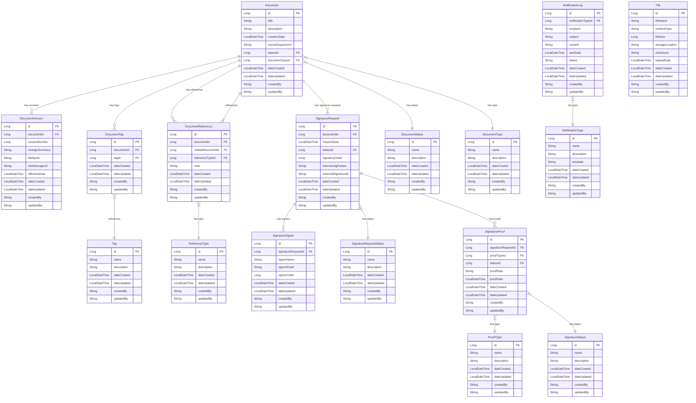

# Firefly Enterprise Content Management

A microservice for managing enterprise documents, including versioning, tagging, references, and digital signatures.

## Table of Contents

- [Overview](#overview)
- [Architecture](#architecture)
- [Entity Relationship Diagram](#entity-relationship-diagram)
- [API Quickstart](#api-quickstart)
  - [Document Management](#document-management)
  - [Document Versions](#document-versions)
  - [Document Tags](#document-tags)
  - [Document References](#document-references)
  - [Signature Requests](#signature-requests)
  - [Signature Proofs](#signature-proofs)
- [Getting Started](#getting-started)
  - [Prerequisites](#prerequisites)
  - [Installation](#installation)
  - [Configuration](#configuration)
- [Contributing](#contributing)
- [License](#license)

## Overview

Firefly Enterprise Content Management (ECM) is a comprehensive solution for managing documents and their lifecycle within an enterprise environment. The system provides capabilities for document storage, versioning, categorization, and digital signatures.

Key features include:
- Document management with versioning
- Document tagging and categorization
- Document references and relationships
- Digital signature workflows
- Notification system for document events

## Architecture

The application is built using a modular architecture with the following components:

- **common-platform-document-mgmt-core**: Core business logic and services
- **common-platform-document-mgmt-interfaces**: Interfaces and DTOs
- **common-platform-document-mgmt-models**: Entity models and repositories
- **common-platform-document-mgmt-sdk**: SDK components and API specifications
- **common-platform-document-mgmt-web**: Web controllers and application configuration

The application is built with Spring Boot and uses reactive programming with Project Reactor for asynchronous, non-blocking operations.

## Entity Relationship Diagram



## API Quickstart

The Firefly ECM provides a RESTful API for managing documents and related entities. All endpoints return reactive Mono or Flux responses.

### Document Management

#### Get Document by ID
```
GET /api/v1/documents/{id}
```

#### Filter Documents
```
POST /api/v1/documents/filter
Content-Type: application/json

{
  "filters": [...],
  "page": 0,
  "size": 10,
  "sort": [...]
}
```

#### Create Document
```
POST /api/v1/documents
Content-Type: application/json

{
  "title": "Document Title",
  "description": "Document Description",
  "ownerDepartment": "Department Name",
  "documentTypeId": 1
}
```

#### Update Document
```
PUT /api/v1/documents/{id}
Content-Type: application/json

{
  "title": "Updated Title",
  "description": "Updated Description",
  "ownerDepartment": "Department Name",
  "documentTypeId": 1,
  "statusId": 2
}
```

#### Delete Document
```
DELETE /api/v1/documents/{id}
```

### Document Versions

#### Get Document Version
```
GET /api/v1/documents/{documentId}/versions/{versionId}
```

#### Get All Versions of a Document
```
GET /api/v1/documents/{documentId}/versions
```

#### Create Document Version
```
POST /api/v1/documents/{documentId}/versions
Content-Type: application/json

{
  "versionNumber": 1,
  "changeSummary": "Initial version",
  "fileName": "document.pdf",
  "blobStorageUrl": "https://storage.example.com/document.pdf",
  "effectiveDate": "2025-07-29T16:41:00Z"
}
```

### Document Tags

#### Add Tag to Document
```
POST /api/v1/documents/{documentId}/tags
Content-Type: application/json

{
  "tagId": 1
}
```

#### Remove Tag from Document
```
DELETE /api/v1/documents/{documentId}/tags/{tagId}
```

### Document References

#### Create Document Reference
```
POST /api/v1/documents/{documentId}/references
Content-Type: application/json

{
  "relatedDocumentId": 2,
  "referenceTypeId": 1,
  "note": "Related document"
}
```

### Signature Requests

#### Create Signature Request
```
POST /api/v1/signature-requests
Content-Type: application/json

{
  "documentId": 1,
  "requestDate": "2025-07-29T16:41:00Z",
  "signatoryOrder": 1,
  "interveningParties": "Party A, Party B"
}
```

#### Get Signature Request by ID
```
GET /api/v1/signature-requests/{id}
```

#### Update Signature Request
```
PUT /api/v1/signature-requests/{id}
Content-Type: application/json

{
  "documentId": 1,
  "statusId": 2,
  "signatoryOrder": 1,
  "interveningParties": "Party A, Party B, Party C"
}
```

### Signature Proofs

#### Create Signature Proof
```
POST /api/v1/signature-proofs
Content-Type: application/json

{
  "signatureRequestId": 1,
  "proofTypeId": 1,
  "statusId": 1,
  "proofData": "Base64 encoded proof data",
  "proofDate": "2025-07-29T16:41:00Z"
}
```

#### Get Signature Proof by ID
```
GET /api/v1/signature-proofs/{id}
```

## Getting Started

### Prerequisites

- Java 17 or higher
- Maven 3.8 or higher
- PostgreSQL database

### Installation

1. Clone the repository
```bash
git clone https://github.com/your-organization/common-platform-document-mgmt.git
cd common-platform-document-mgmt
```

2. Build the project
```bash
mvn clean install
```

3. Run the application
```bash
java -jar common-platform-document-mgmt-web/target/common-platform-document-mgmt-web.jar
```

### Configuration

The application can be configured through the `application.yaml` file in the `common-platform-document-mgmt-web/src/main/resources` directory.

Key configuration properties:
- Database connection
- Storage configuration
- Security settings
- Logging configuration

## Contributing

Please read the CONTRIBUTING.md file for details on our code of conduct and the process for submitting pull requests.

## License

This project is licensed under the terms specified in the LICENSE file.